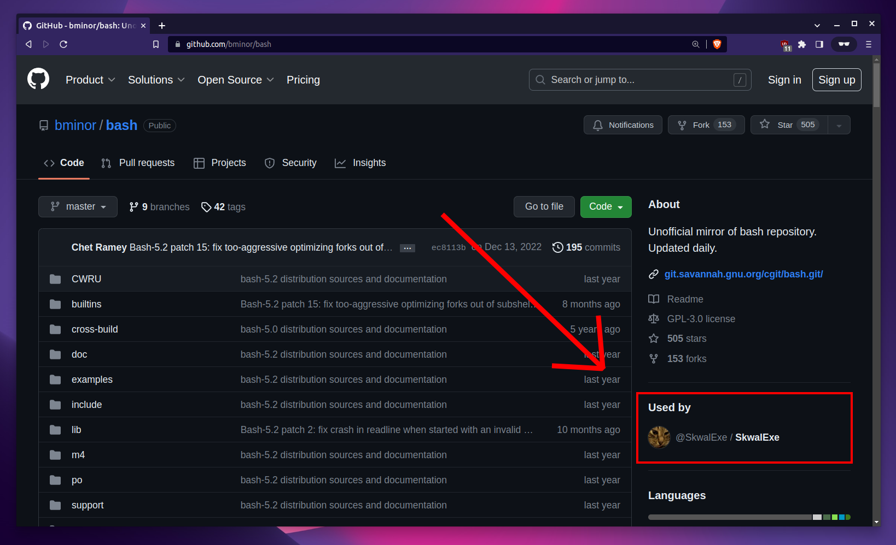
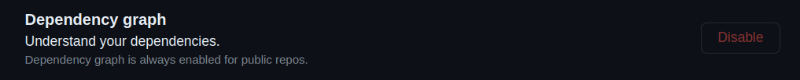

# READ THE BOTTOM OF THIS PAGE IF YOU SAW ME UNDER THE "USED BY" SECTION OF A REPO

# Hi there 👋 


Hello 👋 I'm Léopold Koprivnik, aka SkwalExe. I'm a 15 y/o French 🇫🇷 programming and Linux 🐧 and open source lover. I code in C, rust 🦀, bash, python, and web languages.

### Monero 


`472rHpcwBk64JE9RtNVf7zF4SfoHGcwm9CndYBaXxyYWBK9dHDPXo1qUbsiPXiU96ifveAwjVwZXCHQadVQYT1u61cozJNr`


[](https://ko-fi.com/W7W7AMXI6)


## Presentation 


**Hello 👋 I'm Léopold Koprivnik Ibghy, aka SkwalExe, the founder of skwal.net.**

---


100 day streak goes *wooooooo*


```md
~ ➜ neofetch
                   -`                    skwal@skwarch 
                  .o+`                   ------------- 
                 `ooo/                   OS: Arch Linux x86_64 
                `+oooo:                  Host: MS-7C91 1.0 
               `+oooooo:                 Kernel: 5.16.5-arch1-1 
               -+oooooo+:                Uptime: 3 hours, 30 mins 
             `/:-:++oooo+:               Packages: 1126 (pacman) 
            `/++++/+++++++:              Shell: zsh 5.8 
           `/++++++++++++++:             Resolution: 1920x1080, 3440x1440 
          `/+++ooooooooooooo/`           WM: i3 
         ./ooosssso++osssssso+`          Theme: Adwaita-dark [GTK2/3] 
        .oossssso-````/ossssss+`         Icons: Adwaita [GTK2/3] 
       -osssssso.      :ssssssso.        Terminal: gnome-terminal 
      :osssssss/        osssso+++.       CPU: AMD Ryzen 7 3700X (16) @ 3.600GHz 
     /ossssssss/        +ssssooo/-       GPU: NVIDIA GeForce RTX 3060 
   `/ossssso+/:-        -:/+osssso+-     Memory: 1681MiB / 64297MiB 
  `+sso+:-`                 `.-/+oso:
 `++:.                           `-/+/                           
 .`                                 `/
```

## Projects 🚧


| Project | Description | Repo |
| --- | --- | --- |
| [skwal-net-v2](https://skwal.net) | 🌐 Remake of skwal.net with more modern technologies, goodbye PHP, hello Python and Django | [SkwalExe/skwal-net-v2](https://github.com/SkwalExe/skwal-net-v2) |
| [bouncing-balls]() | 🏀 Highly customizable application that simulates one or more bouncing balls in your terminal. | [SkwalExe/bouncing-balls](https://github.com/SkwalExe/bouncing-balls) |
| [pong-python](https://skwalexe.github.io/pong-python/) | 🏓 Simple terminal pong game made with python | [SkwalExe/pong-python](https://github.com/SkwalExe/pong-python) |
| [flap-python](https://skwalexe.github.io/flap-python/) | 🐤 A simple terminal flappy bird game made with python | [SkwalExe/flap-python](https://github.com/SkwalExe/flap-python) |
| [MessageBox.js](https://skwalexe.github.io/MessageBox.js/example.html) | 💠 Skwal.net message box javascript library - Create beautiful and customizable message boxes 💬 for your website ✨ | [SkwalExe/MessageBox.js](https://github.com/SkwalExe/MessageBox.js) |
| [sorting-algorithms](https://skwalexe.github.io/sorting-algorithms) | 📶 Sorting algorithms visualizer - in your terminal! | [SkwalExe/sorting-algorithms](https://github.com/SkwalExe/sorting-algorithms) |
| [langton-ant-c]() | A terminal Langton's Ant cellular automaton simulator 🐜 | [SkwalExe/langton-ant-c](https://github.com/SkwalExe/langton-ant-c) |
| [les-maths](https://skwalexe.github.io/les-maths) | 📐 Cours de maths gratuits en francais 🇫🇷 | [SkwalExe/les-maths](https://github.com/SkwalExe/les-maths) |
| [snake-python](https://SkwalExe.github.io/snake-python) | A simple snake game made with python 🐍 | [SkwalExe/snake-python](https://github.com/SkwalExe/snake-python) |
| [SkwalExe](https://new.skwal.net) | My profile readme 📃✨ | [SkwalExe/SkwalExe](https://github.com/SkwalExe/SkwalExe) |
| [dtodo](https://skwalexe.github.io/dtodo/) | 📜 Manage the tasks you want to do every day easily | [SkwalExe/dtodo](https://github.com/SkwalExe/dtodo) |
| [Toultip.js](https://skwalexe.github.io/Toultip.js/example.html) | Create beautiful and customizable tooltips 🗨️ for your website 🎇 | [SkwalExe/Toultip.js](https://github.com/SkwalExe/Toultip.js) |
| [game-of-life-c](https://skwalexe.github.io/game-of-life-c) | 🌟 A terminal application to simulate the Conway's game of life cellular automaton 🌟 | [SkwalExe/game-of-life-c](https://github.com/SkwalExe/game-of-life-c) |
| [ascii-video-player](https://skwalexe.github.io/ascii-video-player) | Play videos 📺 files in real time directly in your terminal  | [SkwalExe/ascii-video-player](https://github.com/SkwalExe/ascii-video-player) |
| [math-to-image](https://skwalexe.github.io/math-to-image) | 📐 A vscode extension to convert LaTeX code into remote image links | [SkwalExe/math-to-image](https://github.com/SkwalExe/math-to-image) |
| [Toasteur.js](https://skwalexe.github.io/Toasteur.js/example.html) | Create beautiful and customizable toast notifications 💬 for your website ✨ - Similar to toastr.js but don't need jQuery ❌ | [SkwalExe/Toasteur.js](https://github.com/SkwalExe/Toasteur.js) |
| [cyprint](https://skwalexe.github.io/cyprint) | Print text with typing effect ⌨️ - remake of typrint in C  | [SkwalExe/cyprint](https://github.com/SkwalExe/cyprint) |
| [skwal.net](https://skwal.net) | 🌐 Source code of skwal.net | [SkwalExe/skwal.net](https://github.com/SkwalExe/skwal.net) |
| [linux-on-drugs](https://skwalexe.github.io/linux-on-drugs/) | Gives custom drugs to your terminal 💊 - Output random colors really fast | [SkwalExe/linux-on-drugs](https://github.com/SkwalExe/linux-on-drugs) |
| [apprendre-rust](https://skwalexe.github.io/apprendre-rust/) | Cours gratuits de Rust 🦀 en Francais 🇫🇷 | [SkwalExe/apprendre-rust](https://github.com/SkwalExe/apprendre-rust) |
| [WindowsMessageBox.js](https://skwalexe.github.io/WindowsMessageBox.js/example.html) | Create Windows-like 🪟 message boxes 💬 for your website | [SkwalExe/WindowsMessageBox.js](https://github.com/SkwalExe/WindowsMessageBox.js) |
| [learn-rust](https://skwalexe.github.io/learn-rust/) | Free Rust 🦀 course in English 🇬🇧 | [SkwalExe/learn-rust](https://github.com/SkwalExe/learn-rust) |
| [cowTranslator.js](https://new.skwal.net/cowTranslator) | JavaScript library to translate cow language 🐄 to text  | [SkwalExe/cowTranslator.js](https://github.com/SkwalExe/cowTranslator.js) |
| [FakeFileSystem.js](https://skwalexe.github.io/FakeFileSystem.js) | library to simulate a simple file system in javascript 💾 | [SkwalExe/FakeFileSystem.js](https://github.com/SkwalExe/FakeFileSystem.js) |
| [skwash.js](https://skwalexe.github.io/skwash.js/example.html) | Javascript-driven 🐧 Bash-like shell 🐚 emulator 😍 | [SkwalExe/skwash.js](https://github.com/SkwalExe/skwash.js) |
| [cmdline-parser.js](https://skwalexe.github.io/cmdline-parser.js) | cmdline-parser.js is a tool allowing you to retrieve all the information and components of a command line 🐚 | [SkwalExe/cmdline-parser.js](https://github.com/SkwalExe/cmdline-parser.js) |
| [memz.js](https://skwal.net/memz) | 👾 Library to simulate memz-like virus in a browser | [SkwalExe/memz.js](https://github.com/SkwalExe/memz.js) |
| [TenFastFingersBot](https://skwalexe.github.io/TenFastFingersBot/) | ⌨️ Bot for 10fastfingers.com  | [SkwalExe/TenFastFingersBot](https://github.com/SkwalExe/TenFastFingersBot) |
| [TypeRacer-F1](https://skwalexe.github.io/TypeRacer-F1/) | 🏎️ Autotyper for typeracer.com | [SkwalExe/TypeRacer-F1](https://github.com/SkwalExe/TypeRacer-F1) |
| [rust-logging](https://skwalexe.github.io/rust-logging) | 💬 A couple of functions to make logging in Rust easier. | [SkwalExe/rust-logging](https://github.com/SkwalExe/rust-logging) |
| [rmini-matrix](https://skwalexe.github.io/rmini-matrix/) | 🦀 rust implementation of mini-matrix - much faster - 👨‍💻 Output random 0 and 1 or custom characters with a matrix-like effect | [SkwalExe/rmini-matrix](https://github.com/SkwalExe/rmini-matrix) |
| [lsd-print](https://skwalexe.github.io/lsd-print/ ) | 🧪 Just a print tool, but we gave it lsd | [SkwalExe/lsd-print](https://github.com/SkwalExe/lsd-print) |
| [mini-matrix](https://skwalexe.github.io/mini-matrix/) | 👨‍💻 Output random 0 and 1 or custom characters with a matrix-like effect | [SkwalExe/mini-matrix](https://github.com/SkwalExe/mini-matrix) |
| [typrint](https://skwalexe.github.io/typrint) | ⌨️ Print text with a typing effect - Made with rust 🦀 | [SkwalExe/typrint](https://github.com/SkwalExe/typrint) |
| [cow-translator](https://skwalexe.github.io/cow-translator) | Official moo translator to communicate with cows 🐮 | [SkwalExe/cow-translator](https://github.com/SkwalExe/cow-translator) |
| [cow-encryptor](https://skwalexe.github.io/cow-encryptor) | Encrypt your files in cow language 🐄 | [SkwalExe/cow-encryptor](https://github.com/SkwalExe/cow-encryptor) |
| [help-ukraine](https://skwalexe.github.io/help-ukraine/) | 🇺🇦 Help ukraine in the cyberwar against russia by DDOSing russia government website | [SkwalExe/help-ukraine](https://github.com/SkwalExe/help-ukraine) |
| [Malwares](https://skwalexe.github.io/Malwares/) | 👹 Malwares and jokewares database | [SkwalExe/Malwares](https://github.com/SkwalExe/Malwares) |
| [skwalexe.github.io](https://skwalexe.github.io/) | 💎 Personal website for my github profile | [SkwalExe/skwalexe.github.io](https://github.com/SkwalExe/skwalexe.github.io) |
| [rust-drawing](https://skwalexe.github.io/rust-drawing) | ✏️🦀 Rust drawing allows you to draw incredible and admirable art in your terminal | [SkwalExe/rust-drawing](https://github.com/SkwalExe/rust-drawing) |
| [dotfiles](https://skwalexe.github.io/dotfiles/) | 💠 My personal dotfiles  | [SkwalExe/dotfiles](https://github.com/SkwalExe/dotfiles) |


## If you saw me under the "used by" section of a repo

> 📄 `info` file

```
I am trying to test something. I was looking through different repositories and I noticed something extremely weird. There was always the same user under the "Used By" section of the repo. I think this "Used By" feature can be abused, I will try to display my profile under two famous repos (vim and bash). If it works then I will try to open a ticket to github if no one already did it, this seems to have went unnoticed for a long time.
```

20 minutes after writing this, I was able to make my profile appear on the Bash and Vim repositories. 



I was able to confirm that I wasn't the only one seeing it by visiting the repo in incognito mode. I searched for reports of this problem and I found one. However, github didn't do anything and doesn't seem to understand the HUGE issue this is. This `Used By` feature is enabled on all public repositories and can NOT be disabled or controlled in any way.



This allows ANYONE do display arbitrary text on ANY repository which is a HUGE issue. I don't think anyone has abused this yet, but it is only a matter of time before someone does. Please consider opening a ticket to github about this issue, if enough people report it, they will have to do something about it.

## -> [Report this issue](https://docs.github.com/en/support/contacting-github-support/creating-a-support-ticket)

https://docs.github.com/en/support/contacting-github-support/creating-a-support-ticket